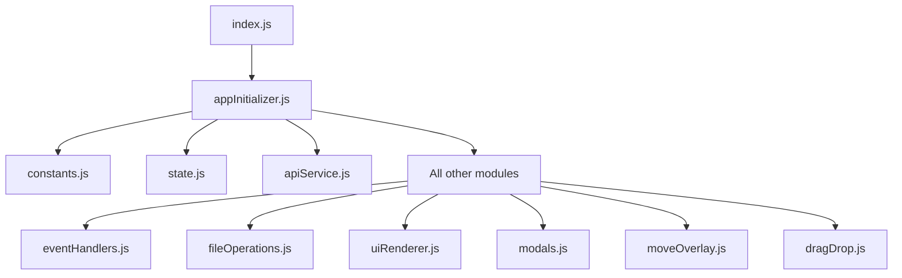

# 📁 File Manager - Modular Architecture

A modern, modular file management system built with PHP backend and vanilla JavaScript frontend.

---

## 🎯 Project Status

**Current Version**: 2.0 (Modular - In Progress)
**Status**: ⚠️ 79% Complete - Missing Features Being Restored
**Last Updated**: 15 November 2025, 11:03 WIB

### Implementation Progress
```
Backend (PHP)        : ✅ 100% Complete
Frontend (Modular)   : ⚠️  79% Complete (9% progress in Phase 1)
Overall Progress     : ⚠️  89% Complete
```

### Recent Milestones
- ✅ **Recent Destinations** (15 Nov 2025) - Move overlay now remembers your 5 most recent destinations

### Active Development
We are currently migrating from a monolithic architecture to a fully modular system. See [`IMPLEMENTATION_ROADMAP.md`](docs/IMPLEMENTATION_ROADMAP.md) for detailed timeline and plan.

---

## 📋 Table of Contents

1. [Features](#-features)
2. [Project Structure](#-project-structure)
3. [Installation](#-installation)
4. [Configuration](#️-configuration)
5. [Usage](#-usage)
6. [Development](#-development)
7. [Documentation](#-documentation)
8. [Contributing](#-contributing)
9. [License](#-license)

---

## ✨ Features

### ✅ Implemented (Working)
- 📂 **File & Folder Management**
  - Browse directories with breadcrumb navigation
  - Create, rename, move, delete files and folders
  - Drag & drop file operations (⚠️ needs integration fix)
  - Context menu for quick actions
  
- 📄 **File Preview & Editing**
  - Text file preview with syntax highlighting
  - Line numbers with scroll sync
  - Media preview (⚠️ images & PDF - being restored)
  
- 📤 **File Operations**
  - Upload files with progress indication
  - Download files
  - Open Word documents in MS Word (multi-fallback approach)
  
- 🎨 **User Interface**
  - Responsive design (desktop & mobile)
  - List and grid view modes
  - Sort by name, size, type, date
  - Real-time polling for directory updates
  - Search and filter capabilities

### ✅ Recently Completed
- 🚀 **Recent Destinations** (15 Nov 2025)
  - ✅ Quick access to 5 most recent move destinations
  - ✅ Automatic reordering on repeated use
  - ✅ Persists across browser sessions with localStorage
  - ✅ One-click navigation to favorite folders

### ⚠️ In Progress (Being Restored)
- 📊 **Activity Logs** (Week 1 - Critical)
  - View server logs with filtering
  - Filter by action, date, path, IP
  - Pagination support
  - Export logs (CSV/JSON)
  - Cleanup old logs
  
- 🚀 **Move Overlay Enhancements** (Week 1-2)
  - ✅ Recent destinations quick access (DONE)
  - ⚠️ Search folders in move modal (TODO)
  - ⚠️ Root and Current shortcuts (TODO)
  
- 🎭 **Media Preview** (Week 1 - Next Priority)
  - Image preview (PNG, JPG, GIF, WebP, SVG)
  - PDF preview
  - Switch between text and media modes

### 🔜 Planned (Week 3-4)
- 🔧 **Advanced Features**
  - Enhanced line numbers synchronization
  - State persistence with localStorage
  - Performance optimizations
  - Comprehensive testing suite

---

## 📁 Project Structure

```
d:/Software/Ekstrak/laragon/www/Filemanager/
│
├── index.php                   # Main entry point (559 lines)
├── api.php                     # API endpoints (585 lines)
├── README.md                   # This file
│
├── assets/
│   ├── css/
│   │   └── style.css          # Main stylesheet (3905 lines)
│   │
│   └── js/
│       ├── index.js           # Application entry point (135 lines)
│       │
│       └── modules/           # Modular JavaScript components
│           ├── apiService.js        # API communication (343 lines)
│           ├── appInitializer.js    # App initialization (996 lines)
│           ├── constants.js         # DOM elements & constants (285 lines)
│           ├── dragDrop.js          # Drag & drop handlers (418 lines)
│           ├── eventHandlers.js     # Event handlers (795 lines)
│           ├── fileIcons.js         # File type icons (68 lines)
│           ├── fileOperations.js    # File operations (702 lines)
│           ├── logManager.js        # Client-side logging (355 lines)
│           ├── modals.js            # Modal management (538 lines)
│           ├── moveOverlay.js       # Move modal logic (642 lines) ✨ UPDATED
│           ├── state.js             # State management (188 lines)
│           ├── uiRenderer.js        # UI rendering (729 lines)
│           └── utils.js             # Utility functions (396 lines)
│
├── lib/
│   ├── file_manager.php       # Core file operations (881 lines)
│   └── logger.php             # Server-side logging (145 lines)
│
├── docs/                      # Project documentation
│   ├── COMPREHENSIVE_MODULAR_ISSUES_REPORT.md  # Detailed analysis
│   ├── IMPLEMENTATION_ROADMAP.md               # 4-week implementation plan
│   ├── PROGRESS_TRACKER.md                     # Daily/weekly tracking
│   ├── EXECUTIVE_SUMMARY.md                    # Stakeholder summary
│   └── REFACTORING_DOCUMENTATION.md           # Refactoring history
│
├── bak/
│   └── Filemanagerbak/        # Original monolithic backup
│       ├── index.php
│       ├── api.php
│       ├── assets/js/index.js  # Monolithic JS (2989 lines)
│       └── ...
│
├── file/                      # User files directory
├── logs/                      # Application logs
└── .gitignore
```

---

## 🚀 Installation

### Prerequisites
- PHP 7.4 or higher
- Web server (Apache/Nginx)
- Modern web browser (Chrome, Firefox, Edge, Safari)

### Steps

1. **Clone or Download**
   ```bash
   git clone <repository-url>
   cd Filemanager
   ```

2. **Set Permissions**
   ```bash
   chmod 755 file/
   chmod 755 logs/
   ```

3. **Configure Web Server**
   
   For Apache, ensure `.htaccess` allows:
   ```apache
   Options +FollowSymLinks
   RewriteEngine On
   ```

4. **Access Application**
   ```
   http://localhost/Filemanager
   ```

---

## ⚙️ Configuration

### Environment Variables

Create a `config.php` (if needed):
```php
<?php
define('BASE_PATH', __DIR__);
define('FILE_ROOT', BASE_PATH . '/file');
define('LOG_PATH', BASE_PATH . '/logs');
define('MAX_UPLOAD_SIZE', 50 * 1024 * 1024); // 50MB
define('ALLOWED_EXTENSIONS', ['pdf', 'doc', 'docx', 'txt', 'jpg', 'png']);
?>
```

### Server Configuration

**Apache** (`php.ini`):
```ini
upload_max_filesize = 50M
post_max_size = 50M
max_execution_time = 300
memory_limit = 256M
```

**Nginx** (`nginx.conf`):
```nginx
client_max_body_size 50M;
```

---

## 💻 Usage

### Basic Operations

#### Browse Files
1. Navigate through folders by clicking on folder names
2. Use breadcrumbs to go back to parent directories
3. Switch between list and grid views using the view toggle

#### Upload Files
1. Click the "Upload" button
2. Select one or more files
3. Files will upload with progress indication

#### File Operations
- **Right-click** on any file/folder for context menu
- **Drag & drop** to move files between folders (⚠️ partial functionality)
- **Click** on a file to preview (text files) or download

#### Preview Files
- Text files open in preview modal with syntax highlighting
- Line numbers sync with scrolling
- Media files (⚠️ being restored for images and PDFs)

### Advanced Features

#### Activity Logs (⚠️ Coming in Week 1)
1. Click "View Logs" button
2. Filter logs by action, date, path, or IP
3. Export filtered results as CSV or JSON
4. Cleanup old logs with one click

#### Move Operations
1. Select file/folder to move
2. Click "Move" from context menu
3. Navigate to destination folder
4. Click "Move Here" button

---

## 🛠️ Development

### Module Architecture

The application uses a modular architecture with clear separation of concerns:



### Adding a New Module

1. Create new file in `assets/js/modules/`:
   ```javascript
   // myModule.js
   export function myFunction() {
       // Your code here
   }
   ```

2. Import in `appInitializer.js`:
   ```javascript
   import { myFunction } from './myModule.js';
   ```

3. Use in initialization or export for other modules

### Development Workflow

1. **Make Changes**: Edit module files
2. **Test Locally**: Refresh browser (no build step needed)
3. **Check Console**: Verify no errors
4. **Test Features**: Ensure functionality works
5. **Commit**: Use meaningful commit messages

### Debugging

Enable debug mode in browser console:
```javascript
localStorage.setItem('debug', 'true');
```

View logs:
```javascript
// Check state
console.log(window.app.state);

// Check API calls
// All API calls are logged in console when debug mode is on
```

---

## 📚 Documentation

### For Users
- **Quick Start Guide**: See [Usage](#-usage) section above
- **FAQ**: See `docs/FAQ.md` (coming soon)

### For Developers
- **Architecture Overview**: [`docs/ARCHITECTURE.md`](docs/ARCHITECTURE.md) (coming soon)
- **API Reference**: See inline comments in `api.php`
- **Module Reference**: See inline JSDoc comments in each module

### For Project Management
- **Implementation Plan**: [`docs/IMPLEMENTATION_ROADMAP.md`](docs/IMPLEMENTATION_ROADMAP.md)
- **Progress Tracking**: [`docs/PROGRESS_TRACKER.md`](docs/PROGRESS_TRACKER.md)
- **Executive Summary**: [`docs/EXECUTIVE_SUMMARY.md`](docs/EXECUTIVE_SUMMARY.md)
- **Technical Analysis**: [`docs/COMPREHENSIVE_MODULAR_ISSUES_REPORT.md`](docs/COMPREHENSIVE_MODULAR_ISSUES_REPORT.md)

---

## 🐛 Known Issues

### Critical (Being Fixed in Week 1)
1. ❌ **Log Modal Missing** - Server log viewing not implemented
2. ✅ **Recent Destinations** - ~~No quick access to frequent folders~~ **FIXED** (15 Nov 2025)
3. ❌ **Media Preview Incomplete** - Images and PDFs cannot be previewed

### High Priority (Being Fixed in Week 2)
4. ⚠️ **Drag & Drop Integration** - Callbacks not properly wired
5. ❌ **Move Search Missing** - Cannot search folders in move modal
6. ❌ **Move Shortcuts Missing** - No Root/Current quick navigation

### Medium Priority (Being Fixed in Week 3)
7. ⚠️ **Line Numbers Sync** - Basic implementation, needs enhancement
8. ❌ **State Persistence Missing** - Preferences not saved across sessions

See [`docs/COMPREHENSIVE_MODULAR_ISSUES_REPORT.md`](docs/COMPREHENSIVE_MODULAR_ISSUES_REPORT.md) for detailed analysis.

---

## 🔄 Migration Status

We are currently migrating from a monolithic architecture (backup) to a fully modular system:

```
Monolithic (Backup)          Modular (Current)
┌──────────────────┐        ┌──────────────────┐
│ index.js         │        │ index.js         │
│ (2989 lines)     │  ====> │ (135 lines)      │
│                  │        │                  │
│ Everything in    │        │ + 13 modules     │
│ one file         │        │   (organized)    │
└──────────────────┘        └──────────────────┘

Status: 79% Complete
Target: 100% by 13 December 2025

Recent Updates:
- ✅ Recent Destinations (15 Nov 2025)
```

### Migration Benefits
✅ **Maintainability**: Easier to find and fix bugs  
✅ **Testability**: Each module can be tested independently  
✅ **Scalability**: Easy to add new features  
✅ **Collaboration**: Multiple developers can work simultaneously  

### Migration Timeline
- **Week 1** (18-22 Nov): Critical features
- **Week 2** (25-29 Nov): High priority features
- **Week 3** (2-6 Dec): Medium priority features
- **Week 4** (9-13 Dec): Polish and deployment

---

## 🤝 Contributing

We welcome contributions! Here's how:

### Reporting Issues
1. Check [Known Issues](#-known-issues) first
2. Create detailed issue with:
   - Steps to reproduce
   - Expected vs actual behavior
   - Browser and OS info
   - Screenshots if applicable

### Submitting Changes
1. Fork the repository
2. Create feature branch: `git checkout -b feature/my-feature`
3. Make your changes following the [Module Architecture](#module-architecture)
4. Test thoroughly
5. Commit: `git commit -am 'Add my feature'`
6. Push: `git push origin feature/my-feature`
7. Create Pull Request

### Code Standards
- Use ES6+ JavaScript features
- Follow existing code style
- Add JSDoc comments for functions
- Keep modules focused and small
- Test your changes

---

## 🔒 Security

### Reporting Security Issues
**DO NOT** create public issues for security vulnerabilities.  
Email: security@example.com

### Security Features
- ✅ Path traversal prevention
- ✅ File type validation
- ✅ File size limits
- ✅ Input sanitization
- ✅ CSRF protection (partial)
- ⚠️ XSS prevention (being enhanced)

---

## 📝 Changelog

### Version 2.0 (In Progress) - Modular Architecture
**Target Release**: 13 December 2025

**Added**:
- Modular JavaScript architecture (13 modules)
- Better code organization
- Improved maintainability
- ✅ Recent Destinations for Move Overlay (15 Nov 2025)

**In Progress**:
- Log Modal functionality
- Media preview enhancements
- Move search & shortcuts
- Performance optimizations

**Fixed**:
- TBD during implementation

### Version 1.0 (Backup) - Monolithic
**Status**: Archived

All functionality in single 2989-line JavaScript file. Fully functional but difficult to maintain.

---

## 📞 Support

### Getting Help
- **Documentation**: Check [`docs/`](docs/) folder
- **Issues**: Create GitHub issue
- **Email**: support@example.com

### Office Hours
- **Team Standup**: Daily 10am WIB
- **Code Review**: Mon/Wed/Fri 2pm WIB
- **Office Hours**: Mon-Fri 9am-6pm WIB

---

## 📄 License

[Your License Here - e.g., MIT, GPL, etc.]

---

## 🙏 Acknowledgments

- Original monolithic implementation
- Team members contributing to modular migration
- Open source libraries used:
  - None (vanilla JavaScript & PHP)

---

## 🗺️ Roadmap

### Short Term (Next 4 Weeks)
- [x] Complete technical analysis
- [x] Create implementation roadmap
- [ ] Implement critical features (Week 1)
- [ ] Implement high priority features (Week 2)
- [ ] Implement medium priority features (Week 3)
- [ ] Polish and deploy (Week 4)

### Medium Term (3-6 Months)
- [ ] Add user authentication
- [ ] Add file sharing capabilities
- [ ] Add file versioning
- [ ] Add collaborative editing
- [ ] Mobile app (PWA)

### Long Term (6-12 Months)
- [ ] Cloud storage integration
- [ ] Advanced search with indexing
- [ ] File encryption
- [ ] Audit trail and compliance
- [ ] API for third-party integrations

---

## 📊 Project Stats

```
Total Lines of Code: ~8,500
Backend (PHP):       ~1,600 lines
Frontend (JS):       ~5,700 lines (modular)
Styles (CSS):        ~3,900 lines
Documentation:       ~2,500 lines

Modules:             13
API Endpoints:       11
Test Coverage:       0% → Target 80%
```

---

**Last Updated**: 15 November 2025, 11:03 WIB
**Project Status**: 🟢 Active Development - Phase 1 in Progress
**Latest Achievement**: ✅ Recent Destinations Implemented
**Next Task**: 🎯 Media Preview Enhancement
**Next Milestone**: Phase 1 Demo - 22 November 2025

---

For detailed implementation timeline and progress tracking, see:
- 📋 [Implementation Roadmap](docs/IMPLEMENTATION_ROADMAP.md)
- 📊 [Progress Tracker](docs/PROGRESS_TRACKER.md)
- 📄 [Executive Summary](docs/EXECUTIVE_SUMMARY.md)

*Let's build something great together!* 🚀
