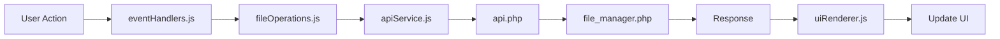

# 🚀 GETTING STARTED - Panduan Memulai Implementasi

**Target**: Memulai Phase 1 - Critical Features Implementation  
**Timeline**: Minggu 1 (18-22 November 2025)  
**Status**: Ready to Start

---

## 📋 QUICK START CHECKLIST

### Persiapan (Hari Ini - 30 Menit)
- [ ] Baca dokumen ini sampai selesai
- [ ] Review [`IMPLEMENTATION_ROADMAP.md`](IMPLEMENTATION_ROADMAP.md) - fokus Phase 1
- [ ] Review [`COMPREHENSIVE_MODULAR_ISSUES_REPORT.md`](COMPREHENSIVE_MODULAR_ISSUES_REPORT.md) - pahami masalah
- [ ] Setup development environment
- [ ] Siap mulai coding!

---

## 🎯 LANGKAH 1: PERSIAPAN DEVELOPMENT

### 1.1 Setup Git Branch (5 menit)

```bash
# Pastikan di main/master branch dan up-to-date
git checkout main
git pull origin main

# Buat feature branch untuk Phase 1
git checkout -b feature/phase1-critical-features

# Verifikasi branch
git branch
# Output: * feature/phase1-critical-features
```

### 1.2 Backup Current State (5 menit)

```bash
# Buat backup point sebelum mulai
git add .
git commit -m "docs: Add comprehensive roadmap and documentation before Phase 1 start"
git push origin feature/phase1-critical-features
```

### 1.3 Setup Development Tools (10 menit)

**Install/Verify Tools:**
```bash
# 1. Code Editor: VSCode (sudah ada ✅)

# 2. Browser DevTools
# - Chrome DevTools (recommended)
# - Firefox Developer Tools (optional)

# 3. Git untuk version control (sudah ada ✅)

# 4. Local Server (Laragon sudah running ✅)
# Akses: http://localhost/Filemanager
```

**VSCode Extensions (Optional but Recommended):**
- ESLint (untuk JavaScript linting)
- PHP Intelephense (untuk PHP support)
- Live Server (untuk quick reload)
- GitLens (untuk Git visualization)

### 1.4 Verify Environment (5 menit)

```bash
# 1. Test aplikasi berjalan
# Buka browser: http://localhost/Filemanager
# Pastikan aplikasi load tanpa error

# 2. Cek console untuk errors
# F12 -> Console tab
# Seharusnya tidak ada error merah

# 3. Test basic functionality
# - Browse folders ✅
# - Upload file ✅
# - Preview text file ✅
# - Delete file ✅
```

---

## 🎯 LANGKAH 2: MEMAHAMI STRUKTUR KODE

### 2.1 Review File Backup (15 menit)

**File penting untuk referensi:**

```bash
# 1. JavaScript Backup (Monolithic)
bak/Filemanagerbak/assets/js/index.js
# Line 2905-3194: Log Modal functionality
# Line 2482-2537: Recent Destinations
# Line 1404-1550: Media Preview

# 2. Backend (Sudah sama dengan current)
bak/Filemanagerbak/lib/file_manager.php
bak/Filemanagerbak/api.php
```

**Action:**
```bash
# Buka file backup untuk reference
code bak/Filemanagerbak/assets/js/index.js
# Bookmark lines: 2905, 2482, 1404 (Ctrl+G untuk jump to line)
```

### 2.2 Review File Current (15 menit)

**File yang akan dimodifikasi:**

```bash
# File baru yang akan dibuat:
assets/js/modules/logModal.js      # BARU - untuk Log Modal

# File yang akan diupdate:
assets/js/modules/moveOverlay.js   # Tambah Recent Destinations
assets/js/modules/modals.js        # Tambah Media Preview
assets/js/modules/appInitializer.js # Wire up semua modul baru
```

**Action:**
```bash
# Buka files yang akan dimodifikasi
code assets/js/modules/moveOverlay.js
code assets/js/modules/modals.js
code assets/js/modules/appInitializer.js
```

### 2.3 Pahami Flow Data (10 menit)



**Konsep Penting:**
1. **State Management**: Semua state di `state.js`
2. **API Calls**: Semua lewat `apiService.js`
3. **UI Updates**: Semua lewat `uiRenderer.js`
4. **Events**: Semua di `eventHandlers.js`

---

## 🎯 LANGKAH 3: MULAI IMPLEMENTASI PHASE 1

### Pilihan A: Mulai dengan Log Modal (Recommended - Paling Complex)

**Kenapa mulai dengan Log Modal?**
- ✅ Paling critical untuk debugging
- ✅ Paling kompleks, selesaikan yang sulit dulu
- ✅ Tidak ada dependency ke fitur lain
- ✅ Bisa dikerjakan independent

**Action:**
```bash
# 1. Buat file baru
touch assets/js/modules/logModal.js

# 2. Buka file
code assets/js/modules/logModal.js

# 3. Mulai dengan template dasar
```

**Template Starter (`logModal.js`):**
```javascript
/**
 * Log Modal Module
 * Handles server log viewing, filtering, pagination, export, and cleanup
 * 
 * Reference: bak/Filemanagerbak/assets/js/index.js lines 2905-3194
 */

import { state } from './state.js';
import { apiCall } from './apiService.js';
import { 
    logModal, logFilterSection, logFilterToggle,
    logTableBody, logPagination, logCleanupBtn,
    logExportCsvBtn, logExportJsonBtn, logAutoRefreshToggle
} from './constants.js';

/**
 * Initialize log modal functionality
 */
export function initializeLogModal() {
    console.log('Initializing Log Modal...');
    
    // TODO: Setup event listeners
    setupLogModalEvents();
    
    // TODO: Setup filter section
    initializeLogFilterSection();
    
    // TODO: Setup auto-refresh
    setupAutoRefresh();
}

function setupLogModalEvents() {
    // TODO: Implement event handlers
}

function initializeLogFilterSection() {
    // TODO: Implement filter section
}

function setupAutoRefresh() {
    // TODO: Implement auto-refresh
}

// Export additional functions as needed
```

**Next Steps:**
1. Copy relevant code dari backup (lines 2905-3194)
2. Adapt ke modular structure
3. Test setiap fungsi step-by-step
4. Update `appInitializer.js` untuk load module ini

---

### Pilihan B: Mulai dengan Recent Destinations (Easier - Quick Win)

**Kenapa mulai dengan Recent Destinations?**
- ✅ Lebih sederhana, quick win untuk momentum
- ✅ LocalStorage pattern simple
- ✅ Immediate visible benefit
- ✅ Bisa selesai dalam 1 hari

**Action:**
```bash
# 1. Buka file yang akan dimodifikasi
code assets/js/modules/moveOverlay.js

# 2. Scroll ke bagian atas, tambahkan functions
```

**Functions to Add (dari backup lines 2482-2537):**
```javascript
// Add to moveOverlay.js

/**
 * Load recent destinations from localStorage
 */
function loadMoveRecentsFromStorage() {
    const raw = localStorage.getItem('fm.moveRecents');
    if (!raw) return [];
    
    try {
        const arr = JSON.parse(raw);
        return Array.from(new Set(arr.filter(p => typeof p === 'string')));
    } catch (e) {
        console.error('Failed to parse move recents:', e);
        return [];
    }
}

/**
 * Save recent destinations to localStorage
 */
function saveMoveRecentsToStorage(list) {
    const unique = Array.from(new Set(list.slice(0, 10)));
    localStorage.setItem('fm.moveRecents', JSON.stringify(unique));
}

/**
 * Add a destination to recent list
 */
function addRecentDestination(path) {
    const list = state.move.recents.slice();
    const idx = list.indexOf(path);
    
    // Remove if exists (to move to top)
    if (idx !== -1) list.splice(idx, 1);
    
    // Add to top
    list.unshift(path);
    
    // Update state (max 10)
    state.move.recents = list.slice(0, 10);
    
    // Persist to localStorage
    saveMoveRecentsToStorage(state.move.recents);
    
    // Update UI
    updateMoveRecentsUI();
}

/**
 * Update recent destinations UI
 */
function updateMoveRecentsUI() {
    const moveRecents = document.getElementById('move-recents');
    if (!moveRecents) return;
    
    moveRecents.innerHTML = '';
    const recents = state.move.recents;
    
    if (recents.length === 0) {
        moveRecents.style.display = 'none';
        return;
    }
    
    moveRecents.style.display = '';
    
    recents.forEach(p => {
        const chip = document.createElement('button');
        chip.className = 'move-chip';
        chip.textContent = p === '' ? 'Root' : (p.split('/').pop() || p);
        chip.title = p || '/';
        
        chip.addEventListener('click', () => {
            state.move.browserPath = p;
            fetchMoveDirectory(p);
        });
        
        moveRecents.appendChild(chip);
    });
}

// Don't forget to export these functions!
export { 
    loadMoveRecentsFromStorage,
    addRecentDestination,
    updateMoveRecentsUI
};
```

**Integration Points:**
1. **On move overlay open**: Load recents dari localStorage
2. **After successful move**: Add destination to recents
3. **On recent chip click**: Navigate to that path

---

### Pilihan C: Mulai dengan Media Preview (Medium Difficulty)

**Kenapa mulai dengan Media Preview?**
- ✅ User-facing feature, immediate impact
- ✅ Medium complexity
- ✅ Standalone functionality

**Action:**
```bash
# Buka file yang akan dimodifikasi
code assets/js/modules/modals.js
```

**Functions to Add:**
```javascript
// Add to modals.js

/**
 * Set preview mode (text or media)
 */
function setPreviewMode(mode) {
    state.preview.mode = mode;
    
    const editorWrapper = document.getElementById('preview-editor-wrapper');
    const viewerWrapper = document.getElementById('preview-viewer-wrapper');
    
    if (mode === 'text') {
        editorWrapper.style.display = '';
        viewerWrapper.style.display = 'none';
    } else {
        editorWrapper.style.display = 'none';
        viewerWrapper.style.display = 'block';
    }
}

/**
 * Open media preview (images, PDF)
 */
export function openMediaPreview(item) {
    setPreviewMode('media');
    
    const viewer = document.getElementById('preview-viewer');
    if (!viewer) {
        console.error('Preview viewer element not found');
        return;
    }
    
    viewer.innerHTML = '';
    
    const extension = item.name.split('.').pop().toLowerCase();
    const url = buildFileUrl(item.path);
    
    let el;
    
    if (extension === 'pdf') {
        // PDF preview
        el = document.createElement('iframe');
        el.src = url;
        el.style.width = '100%';
        el.style.height = '600px';
        el.style.border = 'none';
    } else {
        // Image preview
        el = document.createElement('img');
        el.src = url;
        el.alt = item.name;
        el.style.maxWidth = '100%';
        el.style.height = 'auto';
        
        // Add loading state
        el.onload = () => {
            console.log('Image loaded successfully');
        };
        
        el.onerror = () => {
            viewer.innerHTML = '<p>Failed to load image</p>';
        };
    }
    
    viewer.appendChild(el);
    
    // Open modal
    if (previewModal) {
        previewModal.classList.add('show');
    }
}

// Export
export { setPreviewMode, openMediaPreview };
```

---

## 🎯 LANGKAH 4: WORKFLOW DEVELOPMENT

### 4.1 Development Cycle (Repeat for Each Feature)

```
1. READ BACKUP CODE
   └─> Pahami logic & flow
       
2. WRITE NEW CODE
   └─> Adapt ke modular structure
       
3. TEST LOCALLY
   └─> F5 refresh browser
       └─> Check console for errors
           └─> Test functionality
               
4. FIX BUGS
   └─> Debug di DevTools
       └─> Fix issues
           └─> Repeat test
               
5. COMMIT
   └─> Git add & commit
       └─> Push to branch
```

### 4.2 Testing Checklist Per Feature

**Log Modal:**
- [ ] Modal opens on button click
- [ ] Filters apply correctly
- [ ] Pagination works
- [ ] Export CSV works
- [ ] Export JSON works
- [ ] Cleanup works with confirmation
- [ ] Auto-refresh toggle works
- [ ] No console errors

**Recent Destinations:**
- [ ] Loads from localStorage on open
- [ ] Saves to localStorage after move
- [ ] Shows max 10 recents
- [ ] Clicking chip navigates correctly
- [ ] Duplicates move to top
- [ ] No console errors

**Media Preview:**
- [ ] Images preview correctly
- [ ] PDF preview in iframe
- [ ] Loading state shows
- [ ] Error handling works
- [ ] Mode switching (text ↔ media) works
- [ ] No console errors

### 4.3 Git Commit Strategy

**Commit Frequently:**
```bash
# After completing a function
git add assets/js/modules/logModal.js
git commit -m "feat(log-modal): Add fetchLogDataWithFilters function"

# After completing a feature section
git add assets/js/modules/moveOverlay.js
git commit -m "feat(move): Add recent destinations with localStorage"

# After testing passes
git commit -m "test(move): Verify recent destinations work correctly"

# Push regularly (daily)
git push origin feature/phase1-critical-features
```

**Commit Message Format:**
```
<type>(<scope>): <short description>

Types:
- feat: New feature
- fix: Bug fix
- docs: Documentation
- test: Testing
- refactor: Code refactoring
- style: Code style (formatting)

Examples:
feat(log-modal): Implement filter functionality
fix(move): Correct recent destinations sorting
docs(readme): Update installation guide
test(preview): Add media preview tests
```

---

## 🎯 LANGKAH 5: DAILY ROUTINE

### Morning (9:00-12:00)

**09:00 - 09:30: Planning**
```bash
# 1. Review yesterday's progress
# 2. Check PROGRESS_TRACKER.md
# 3. Plan today's tasks
# 4. Update TODO list
```

**09:30 - 10:00: Team Standup (if applicable)**
```
Questions to answer:
- What did I complete yesterday?
- What will I work on today?
- Any blockers?
```

**10:00 - 12:00: Focused Development**
```bash
# Deep work on current feature
# No distractions
# Code, test, commit cycle
```

### Afternoon (13:00-18:00)

**13:00 - 15:00: Continued Development**
```bash
# Continue from morning
# Test thoroughly
# Fix bugs
```

**15:00 - 17:00: Testing & Documentation**
```bash
# Test all changes
# Update comments
# Update PROGRESS_TRACKER.md
```

**17:00 - 18:00: Wrap Up**
```bash
# Final commits
# Push to Git
# Update PROGRESS_TRACKER.md
# Plan tomorrow
```

### End of Day Checklist
- [ ] All code committed
- [ ] All code pushed
- [ ] PROGRESS_TRACKER.md updated
- [ ] No console errors
- [ ] Features tested
- [ ] Tomorrow's plan ready

---

## 🎯 LANGKAH 6: TRACKING PROGRESS

### Update Todo List Daily

```bash
# Mark completed items
# Todo list akan otomatis sync di VSCode
# Contoh:
[x] Setup development environment
[-] Implement Log Modal (in progress)
[ ] Implement Recent Destinations
```

### Update PROGRESS_TRACKER.md Daily

```markdown
#### Day 1 (Mon, 18 Nov) - Log Modal Start
- [x] Setup logModal.js module structure
- [x] Define state management for logs
- [-] Setup API integration (50% done)
- [ ] Build filter UI handlers

**Target**: Core structure & filter implementation (50% of Log Modal)  
**Actual**: 40% - API integration slower than expected
**Status**: 🟨 In Progress

**Blockers**: Need to understand API response format better
```

### Weekly Summary (Friday EOD)

```markdown
**Week 1 Summary**:
- Features Completed: Recent Destinations ✅, Media Preview ✅
- Features In Progress: Log Modal (80%)
- Bugs Found: 3 (all fixed)
- Bugs Fixed: 3
- Blockers: None
- Next Week Focus: Complete Log Modal, start Phase 2
```

---

## 🚨 TROUBLESHOOTING

### Common Issues & Solutions

#### Issue 1: Module Not Loading
```
Error: Failed to load module script: Expected a JavaScript module script...
```

**Solution:**
```javascript
// Make sure script tag has type="module"
<script type="module" src="assets/js/index.js"></script>

// Check import/export syntax
export function myFunction() { }  // ✅ Correct
export myFunction() { }           // ❌ Wrong
```

#### Issue 2: Function Not Defined
```
Error: functionName is not defined
```

**Solution:**
```javascript
// Check if function is imported
import { functionName } from './module.js';

// Check if function is exported
export function functionName() { }
```

#### Issue 3: State Not Updating
```
State changes but UI doesn't update
```

**Solution:**
```javascript
// Always call UI update function after state change
state.move.recents = newRecents;
updateMoveRecentsUI();  // Don't forget this!
```

#### Issue 4: localStorage Not Working
```
localStorage.getItem returns null
```

**Solution:**
```javascript
// Check browser privacy settings
// Check if localStorage is enabled
try {
    localStorage.setItem('test', 'test');
    localStorage.removeItem('test');
} catch (e) {
    console.error('localStorage not available:', e);
}
```

---

## 📞 GETTING HELP

### When Stuck (After 30 Minutes)

1. **Check Documentation**
   - Review backup code
   - Check browser DevTools console
   - Search similar code in current modules

2. **Debug Systematically**
   ```javascript
   // Add console.log at each step
   console.log('1. Function called');
   console.log('2. Data:', data);
   console.log('3. Result:', result);
   ```

3. **Ask for Help**
   - Describe problem clearly
   - Share error messages
   - Share relevant code snippet
   - Explain what you've tried

### Resources

- **MDN Web Docs**: https://developer.mozilla.org
- **JavaScript.info**: https://javascript.info
- **PHP Manual**: https://www.php.net/manual/en/

---

## ✅ RECOMMENDATION: START HERE

### Recommended Starting Point (Choose One)

**Option 1: Quick Win Approach** (Recommended untuk momentum)
```
Day 1: Recent Destinations (easy, 4 hours)
Day 2: Media Preview (medium, 6 hours)
Day 3-5: Log Modal (hard, 3 days)
```
✅ Pros: Early wins, build confidence  
❌ Cons: Save hardest for last

**Option 2: Hard First Approach** (Recommended untuk risk mitigation)
```
Day 1-3: Log Modal (hard, 3 days)
Day 4: Recent Destinations (easy, 4 hours)
Day 5: Media Preview (medium, 6 hours)
```
✅ Pros: Biggest risk done first  
❌ Cons: Slower initial progress

**Option 3: Balanced Approach** (My Recommendation)
```
Day 1: Recent Destinations (4h) + Media Preview start (4h)
Day 2: Complete Media Preview (2h) + Log Modal start (6h)
Day 3: Log Modal continued (8h)
Day 4: Log Modal integration & testing (8h)
Day 5: Phase 1 testing & fixes (8h)
```
✅ Pros: Balanced progress & risk  
✅ Pros: Regular wins throughout week

---

## 🎯 YOUR FIRST TASK (Right Now - 2 Hours)

### Step-by-Step untuk 2 Jam Pertama

**[0-15 min] Setup**
```bash
git checkout -b feature/phase1-critical-features
git push origin feature/phase1-critical-features
```

**[15-45 min] Recent Destinations Implementation**
1. Buka `assets/js/modules/moveOverlay.js`
2. Copy functions dari backup (lines 2482-2537)
3. Adapt ke modular structure
4. Add exports

**[45-75 min] Integration**
1. Update `openMoveOverlay()` untuk load recents
2. Update `performMove()` untuk save recent
3. Test di browser

**[75-120 min] Testing & Commit**
1. Test load from localStorage
2. Test save after move
3. Test click navigation
4. Fix any bugs
5. Commit & push

**Success Criteria:**
- [ ] Recent destinations load dari localStorage
- [ ] After move, destination saved to recents
- [ ] Clicking recent chip navigates correctly
- [ ] Max 10 recents enforced
- [ ] No console errors

---

## 🚀 READY TO START?

### Pre-Flight Checklist

- [ ] Git branch created: `feature/phase1-critical-features`
- [ ] VSCode open dengan files yang tepat
- [ ] Browser dengan DevTools ready
- [ ] [`IMPLEMENTATION_ROADMAP.md`](IMPLEMENTATION_ROADMAP.md) dibaca
- [ ] [`PROGRESS_TRACKER.md`](PROGRESS_TRACKER.md) siap untuk update
- [ ] Coffee/tea ready ☕
- [ ] No distractions untuk 2 jam
- [ ] Let's go! 🚀

### First Command to Run

```bash
# Mulai dengan Recent Destinations (quick win!)
code assets/js/modules/moveOverlay.js

# Reference backup code
code bak/Filemanagerbak/assets/js/index.js
# Jump to line 2482 (Ctrl+G)

# Let's build! 💪
```

---

**Good luck!** Jika ada pertanyaan atau butuh bantuan, refer ke dokumentasi atau ask for help. You got this! 🎯

**Next Update**: End of Day 1 (18 Nov 2025)  
**Document**: [`PROGRESS_TRACKER.md`](PROGRESS_TRACKER.md)