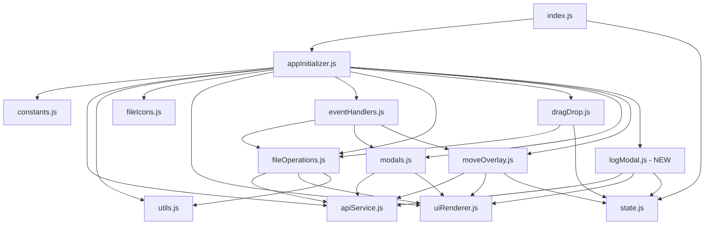

# 🗺️ ROADMAP IMPLEMENTASI PERBAIKAN FILE MANAGER
## Dari Backup Monolithic ke Modular Complete

**Versi**: 1.0  
**Tanggal**: 15 November 2025  
**Status**: 70% Complete → Target 100%  
**Estimasi Waktu**: 4 Minggu (20 hari kerja)

---

## 📊 EXECUTIVE SUMMARY

### Current State
- **Backend**: ✅ 100% Complete (Identik dengan backup)
- **Frontend**: ⚠️ 70% Complete (Struktur modular bagus, banyak fitur missing)

### Target State
- **Backend**: ✅ 100% Complete (Maintain)
- **Frontend**: 🎯 100% Complete (Semua fitur backup ter-implementasi)

### Critical Path
```
Week 1: Critical Features → Week 2: High Priority → Week 3: Medium Priority → Week 4: Polish & Deploy
```

---

## 🎯 OBJECTIVES & SUCCESS CRITERIA

### Primary Objectives
1. ✅ Implementasi semua fitur yang hilang dari backup
2. ✅ Maintain modular architecture yang sudah ada
3. ✅ Zero breaking changes untuk fitur yang sudah bekerja
4. ✅ Full backward compatibility dengan backup functionality

### Success Criteria
- [ ] Semua 10 fitur critical/high priority terimplementasi
- [ ] Integration tests pass 100%
- [ ] No regression pada fitur existing
- [ ] Performance sama atau lebih baik dari backup
- [ ] Documentation complete untuk semua modules

---

## 📅 TIMELINE OVERVIEW

```mermaid
gantt
    title Implementation Roadmap - 4 Weeks
    dateFormat YYYY-MM-DD
    section Phase 1 Critical
    Log Modal           :crit, p1a, 2025-11-18, 3d
    Recent Destinations :crit, p1b, 2025-11-18, 2d
    Media Preview       :crit, p1c, 2025-11-20, 2d
    Testing Phase 1     :crit, p1d, 2025-11-22, 1d
    
    section Phase 2 High
    Drag Drop Fix       :high, p2a, 2025-11-25, 2d
    Move Search         :high, p2b, 2025-11-25, 2d
    Move Shortcuts      :high, p2c, 2025-11-27, 1d
    Testing Phase 2     :high, p2d, 2025-11-28, 1d
    
    section Phase 3 Medium
    Line Numbers Sync   :med, p3a, 2025-12-02, 2d
    State Persistence   :med, p3b, 2025-12-02, 2d
    Testing Phase 3     :med, p3c, 2025-12-04, 1d
    
    section Phase 4 Polish
    Integration Test    :pol, p4a, 2025-12-05, 2d
    Performance Opt     :pol, p4b, 2025-12-09, 2d
    Documentation       :pol, p4c, 2025-12-11, 2d
    Deployment          :pol, p4d, 2025-12-13, 1d
```

---

## 🔄 PHASE 1: CRITICAL FEATURES (Week 1)
**Timeline**: 18-22 November 2025 (5 hari)  
**Goal**: Restore missing critical functionality

### 1.1 Log Modal Implementation (3 hari)
**Priority**: 🔴 CRITICAL  
**Effort**: High  
**Dependencies**: None

#### Deliverables
- [ ] File baru: `assets/js/modules/logModal.js`
- [ ] Fungsi filtering lengkap (action, date, type, path, IP)
- [ ] Pagination dengan server-side support
- [ ] Export functionality (CSV & JSON)
- [ ] Cleanup logs feature
- [ ] Auto-refresh toggle (30s interval)
- [ ] Integration dengan `appInitializer.js`

#### Tasks Breakdown
```
Day 1 (3h): Setup & Core Structure
├── Create logModal.js module
├── Define state management for logs
├── Setup API integration
└── Basic modal open/close handlers

Day 1 (3h): Filter Implementation
├── Build filter UI handlers
├── Implement applyLogFilter()
├── Implement clearLogFilter()
└── Connect to API endpoints

Day 2 (3h): Pagination & Data Display
├── Implement fetchLogDataWithFilters()
├── Build pagination controls
├── Render log table with data
└── Handle empty states

Day 2 (3h): Advanced Features
├── Implement export (CSV/JSON)
├── Implement cleanup functionality
├── Add auto-refresh toggle
└── Add loading states

Day 3 (6h): Integration & Testing
├── Wire up with appInitializer.js
├── Test all filter combinations
├── Test pagination edge cases
├── Test export functionality
└── Test cleanup with confirmation
```

#### Reference Code
- Backup: `assets/js/index.js` lines 2905-3194
- Current: Create new `logModal.js`

#### Success Metrics
- [x] All 8+ filter types working
- [x] Pagination handles 1000+ logs
- [x] Export generates valid CSV/JSON
- [x] Cleanup requires confirmation
- [x] Auto-refresh doesn't block UI

---

### 1.2 Recent Destinations (2 hari)
**Priority**: 🔴 CRITICAL  
**Effort**: Medium  
**Dependencies**: None

#### Deliverables
- [ ] `loadMoveRecentsFromStorage()` function
- [ ] `saveMoveRecentsToStorage()` function
- [ ] `addRecentDestination()` function
- [ ] `updateMoveRecentsUI()` function
- [ ] localStorage persistence
- [ ] Recent chips UI dengan click handlers

#### Tasks Breakdown
```
Day 1 (4h): Core Functions
├── Add loadMoveRecentsFromStorage()
├── Add saveMoveRecentsToStorage()
├── Add addRecentDestination()
├── Test localStorage read/write
└── Test max 10 items limit

Day 2 (4h): UI & Integration
├── Add updateMoveRecentsUI()
├── Create recent chips with click handlers
├── Update openMoveOverlay() to load recents
├── Update performMove() to save recent
├── Test full user journey
└── Test persistence across sessions
```

#### Reference Code
- Backup: `assets/js/index.js` lines 2482-2537
- Current: Update `moveOverlay.js`

#### Success Metrics
- [x] Max 10 recent destinations stored
- [x] Duplicates removed automatically
- [x] Persists across browser sessions
- [x] Click navigates to destination
- [x] Recent list updates after each move

---

### 1.3 Media Preview (2 hari)
**Priority**: 🔴 CRITICAL  
**Effort**: Medium  
**Dependencies**: None

#### Deliverables
- [ ] `openMediaPreview()` function
- [ ] `setPreviewMode()` function
- [ ] `ensurePreviewViewer()` function
- [ ] Support untuk images (PNG, JPG, GIF, WebP, SVG)
- [ ] Support untuk PDF documents
- [ ] Mode switching (text ↔ media)

#### Tasks Breakdown
```
Day 1 (4h): Core Functions
├── Add openMediaPreview() to modals.js
├── Add setPreviewMode() with UI switching
├── Add ensurePreviewViewer()
├── Verify HTML structure in index.php
└── Test basic image preview

Day 2 (4h): Full Support & Polish
├── Add PDF preview support
├── Add loading states for large files
├── Add error handling for failed loads
├── Test all supported formats
├── Test mode switching
└── Test close/cleanup
```

#### Reference Code
- Backup: `assets/js/index.js` lines 1404-1550
- Current: Update `modals.js`

#### Success Metrics
- [x] All image formats preview correctly
- [x] PDF loads in iframe
- [x] Mode switching works seamlessly
- [x] Loading states visible for slow loads
- [x] Error handling for unsupported types

---

### 1.4 Phase 1 Testing (1 hari)
**Priority**: 🔴 CRITICAL  
**Effort**: Medium

#### Test Scenarios
```
Log Modal Tests:
├── Filter by single parameter
├── Filter by multiple parameters
├── Pagination next/prev
├── Pagination jump to page
├── Export CSV with filters
├── Export JSON with filters
├── Cleanup with confirmation
├── Cleanup cancel
└── Auto-refresh toggle

Recent Destinations Tests:
├── First move saves to recents
├── Duplicate move moves to top
├── Max 10 items enforced
├── localStorage persistence
├── Click navigates correctly
└── Empty state handled

Media Preview Tests:
├── Preview PNG image
├── Preview JPG image
├── Preview GIF animation
├── Preview PDF document
├── Preview SVG graphic
├── Switch to text mode
├── Switch back to media mode
└── Close cleans up resources
```

---

## 🔄 PHASE 2: HIGH PRIORITY (Week 2)
**Timeline**: 25-29 November 2025 (5 hari)  
**Goal**: Fix integration issues and complete move functionality

### 2.1 Drag & Drop Integration Fix (2 hari)
**Priority**: 🟠 HIGH  
**Effort**: Medium  
**Dependencies**: Phase 1 complete

#### Current Issue
```javascript
// dragDrop.js - Line 180
moveItem(
    sourcePath, targetPath, state,
    () => { /* setLoading - will be implemented later */ },
    (error) => { console.error('Move error:', error); },
    null, // fetchDirectory
    null, // flashStatus
    null  // buildFileUrl
);
```

#### Deliverables
- [ ] Wire `setLoading` callback dari `uiRenderer.js`
- [ ] Wire `setError` callback dari `uiRenderer.js`
- [ ] Wire `fetchDirectory` callback dari `fileOperations.js`
- [ ] Wire `flashStatus` callback dari `uiRenderer.js`
- [ ] Wire `buildFileUrl` callback dari `utils.js`
- [ ] Test all drag scenarios

#### Tasks Breakdown
```
Day 1 (4h): Callback Wiring
├── Import required functions
├── Create callback wrapper functions
├── Update moveItem() calls
├── Test basic drag to folder
└── Verify loading states work

Day 2 (4h): Full Integration & Testing
├── Test drag file to folder
├── Test drag folder to folder
├── Test drag to up-row
├── Test drag to body/file-card
├── Test prevent drop folder into itself
├── Test visual feedback (classes)
└── Test error scenarios
```

#### Reference Code
- Backup: `assets/js/index.js` lines 2254-2410
- Current: Update `dragDrop.js`

#### Success Metrics
- [x] All 5 callbacks properly wired
- [x] Loading indicator shows during move
- [x] Error messages display correctly
- [x] Directory refreshes after move
- [x] Status message flashes on success

---

### 2.2 Move Search & Shortcuts (3 hari)
**Priority**: 🟠 HIGH  
**Effort**: Medium  
**Dependencies**: Phase 1.2 (Recent Destinations)

#### 2.2.1 Search Implementation (2 hari)

##### Deliverables
- [ ] Search input event handler
- [ ] Filter logic dalam `renderMoveUI()`
- [ ] Case-insensitive search
- [ ] Clear search button
- [ ] Keyboard navigation (optional)

##### Tasks Breakdown
```
Day 1 (4h): Core Search
├── Add input event listener
├── Update state.move.search
├── Implement filter logic in renderMoveUI()
├── Test with various search terms
└── Test with empty search

Day 2 (4h): UX Enhancements
├── Add clear search button
├── Add search placeholder
├── Highlight matching text (optional)
├── Add "no results" message
└── Test edge cases (special chars, etc.)
```

#### 2.2.2 Shortcuts Implementation (1 hari)

##### Deliverables
- [ ] Root shortcut handler
- [ ] Current shortcut handler
- [ ] Breadcrumbs update after navigation
- [ ] Visual feedback on click

##### Tasks Breakdown
```
Day 3 (4h): Shortcuts
├── Add Root shortcut click handler
├── Add Current shortcut click handler
├── Test navigation to root
├── Test navigation to current folder
├── Verify breadcrumbs update
└── Test with various current paths
```

#### Reference Code
- Backup: `assets/js/index.js` lines 2841-2879
- Current: Update `moveOverlay.js`

#### Success Metrics
- [x] Search filters folders correctly
- [x] Search is case-insensitive
- [x] Clear button resets search
- [x] Root shortcut goes to /
- [x] Current shortcut goes to current folder
- [x] Breadcrumbs always accurate

---

### 2.3 Phase 2 Testing (1 hari)
**Priority**: 🟠 HIGH  
**Effort**: Medium

#### Test Scenarios
```
Drag & Drop Tests:
├── Drag file to folder (same level)
├── Drag folder to folder (nesting)
├── Drag to up-row (parent directory)
├── Drag to body when empty
├── Prevent folder into itself
├── Visual feedback during drag
├── Loading indicator appears
├── Error handling for failed moves
└── Success status message

Move Search Tests:
├── Search with single word
├── Search with multiple words
├── Search case insensitive
├── Search with special characters
├── Clear search button
├── Empty search shows all
└── No results message

Shortcuts Tests:
├── Root shortcut from nested path
├── Root shortcut from root
├── Current shortcut from different path
├── Current shortcut from current path
└── Breadcrumbs update correctly
```

---

## 🔄 PHASE 3: MEDIUM PRIORITY (Week 3)
**Timeline**: 2-6 December 2025 (5 hari)  
**Goal**: Polish user experience and add quality-of-life features

### 3.1 Advanced Line Numbers Sync (2 hari)
**Priority**: 🟡 MEDIUM  
**Effort**: Medium  
**Dependencies**: None

#### Current Issue
Basic implementation tanpa:
- Line height calculations
- Bottom adjustment untuk files tanpa newline
- Style consistency enforcement

#### Deliverables
- [ ] `ensureConsistentStyling()` function
- [ ] Enhanced `syncLineNumbersScroll()` dengan calculations
- [ ] Bottom adjustment logic
- [ ] Test dengan files berbagai sizes

#### Tasks Breakdown
```
Day 1 (4h): Core Enhancements
├── Add ensureConsistentStyling()
├── Update syncLineNumbersScroll()
├── Add line height calculations
├── Test with small files (<100 lines)
└── Test with medium files (100-1000 lines)

Day 2 (4h): Edge Cases & Polish
├── Add bottom adjustment logic
├── Test files without newline ending
├── Test files with mixed line heights
├── Test with large files (>1000 lines)
└── Performance optimization if needed
```

#### Reference Code
- Backup: `assets/js/index.js` lines 1133-1268
- Current: Update `appInitializer.js`

#### Success Metrics
- [x] Line numbers always aligned
- [x] Works with files ending without newline
- [x] No performance issues with large files
- [x] Smooth scrolling experience
- [x] Style consistency maintained

---

### 3.2 State Persistence (2 hari)
**Priority**: 🟡 MEDIUM  
**Effort**: Low  
**Dependencies**: Phase 1.2 (Recent Destinations pattern)

#### Deliverables
- [ ] Create `utils/storage.js` helper module
- [ ] Save/load sort preferences
- [ ] Save/load view mode (list/grid)
- [ ] Save/load filter preferences
- [ ] Save/load theme preferences (jika ada)

#### Tasks Breakdown
```
Day 1 (4h): Storage Helper
├── Create storage.js module
├── Add saveToStorage(key, value)
├── Add loadFromStorage(key, defaultValue)
├── Add removeFromStorage(key)
├── Add clearAllStorage()
└── Test localStorage operations

Day 2 (4h): Integration
├── Save sort preference on change
├── Load sort preference on init
├── Save view mode on toggle
├── Load view mode on init
├── Test persistence across sessions
└── Test with localStorage disabled
```

#### Reference Code
- Pattern from: Recent Destinations implementation
- New file: `assets/js/modules/storage.js`

#### Success Metrics
- [x] All preferences persist
- [x] Loads correctly on init
- [x] Graceful fallback if localStorage disabled
- [x] No errors in console
- [x] User experience seamless

---

### 3.3 Phase 3 Testing (1 hari)
**Priority**: 🟡 MEDIUM  
**Effort**: Low

#### Test Scenarios
```
Line Numbers Tests:
├── Small file (< 100 lines)
├── Medium file (100-1000 lines)
├── Large file (> 1000 lines)
├── File without newline ending
├── File with empty lines
├── Scroll to top
├── Scroll to middle
├── Scroll to bottom
└── Fast scrolling

State Persistence Tests:
├── Change sort, reload page
├── Change view mode, reload page
├── Multiple changes, reload page
├── Clear localStorage, verify defaults
└── Disable localStorage, verify fallback
```

---

## 🔄 PHASE 4: POLISH & DEPLOYMENT (Week 4)
**Timeline**: 5-13 December 2025 (9 hari)  
**Goal**: Ensure production readiness

### 4.1 Integration Testing (2 hari)
**Priority**: 🟢 POLISH  
**Effort**: High  
**Dependencies**: Phases 1-3 complete

#### Comprehensive Test Suites

##### 4.1.1 End-to-End User Journeys
```
Journey 1: New User Experience
├── [ ] Landing on root directory
├── [ ] Navigate into folders
├── [ ] Use breadcrumbs to go back
├── [ ] Preview various file types
├── [ ] Download a file
└── [ ] Use context menu

Journey 2: File Management
├── [ ] Upload files
├── [ ] Create new folder
├── [ ] Rename items
├── [ ] Move via modal
├── [ ] Move via drag-drop
└── [ ] Delete items

Journey 3: Power User
├── [ ] Use keyboard shortcuts
├── [ ] Bulk operations
├── [ ] Search in move modal
├── [ ] Use recent destinations
├── [ ] View logs with filters
└── [ ] Export log data

Journey 4: Admin Tasks
├── [ ] Open Word documents
├── [ ] View activity logs
├── [ ] Filter logs by criteria
├── [ ] Cleanup old logs
└── [ ] Export reports
```

##### 4.1.2 Cross-Browser Testing
```
Browsers to Test:
├── [ ] Chrome (latest)
├── [ ] Firefox (latest)
├── [ ] Edge (latest)
├── [ ] Safari (latest, Mac only)
└── [ ] Mobile browsers (Chrome/Safari)

Features per Browser:
├── [ ] All modals open/close
├── [ ] Drag & drop works
├── [ ] File preview works
├── [ ] Context menu appears
└── [ ] No console errors
```

##### 4.1.3 Regression Testing
```
Verify No Breaking Changes:
├── [ ] Basic file operations (CRUD)
├── [ ] Word document opening
├── [ ] Context menu actions
├── [ ] Preview modal (text & media)
├── [ ] Polling/auto-refresh
├── [ ] Upload functionality
└── [ ] Download functionality
```

#### Tasks Breakdown
```
Day 1 (6h): E2E & Cross-Browser
├── Run Journey 1-4 tests
├── Test on Chrome
├── Test on Firefox
├── Test on Edge
├── Document any issues
└── Create bug fix tickets

Day 2 (6h): Regression & Edge Cases
├── Run regression test suite
├── Test edge cases (empty dirs, large files, etc.)
├── Test error scenarios (network errors, etc.)
├── Performance benchmarking
└── Create optimization tickets
```

---

### 4.2 Performance Optimization (2 hari)
**Priority**: 🟢 POLISH  
**Effort**: Medium  
**Dependencies**: Phase 4.1 complete

#### Optimization Areas

##### 4.2.1 Code Splitting & Lazy Loading
```
Optimize:
├── [ ] Lazy load logModal.js (on first open)
├── [ ] Lazy load preview for large files
├── [ ] Debounce search inputs (300ms)
├── [ ] Throttle scroll events (100ms)
└── [ ] Cache API responses (where appropriate)
```

##### 4.2.2 Bundle Size Optimization
```
Analyze:
├── [ ] Remove unused code
├── [ ] Minify JavaScript
├── [ ] Optimize CSS
├── [ ] Compress images/icons
└── [ ] Enable gzip/brotli compression
```

##### 4.2.3 Rendering Performance
```
Optimize:
├── [ ] Virtual scrolling for large file lists
├── [ ] Pagination for move modal (>100 folders)
├── [ ] Lazy render log table rows
├── [ ] Optimize line numbers rendering
└── [ ] Reduce DOM manipulations
```

#### Tasks Breakdown
```
Day 1 (6h): Code & Bundle
├── Implement lazy loading
├── Add debounce/throttle
├── Analyze bundle size
├── Remove unused code
└── Minify assets

Day 2 (6h): Rendering
├── Profile rendering performance
├── Implement optimizations
├── Benchmark before/after
├── Verify no regressions
└── Document improvements
```

#### Performance Targets
- [ ] Initial load < 2s (3G network)
- [ ] Time to Interactive < 3s
- [ ] Directory listing < 500ms
- [ ] Search response < 100ms
- [ ] No janky scrolling (60fps)

---

### 4.3 Documentation (2 hari)
**Priority**: 🟢 POLISH  
**Effort**: Medium  
**Dependencies**: All features complete

#### Documentation Deliverables

##### 4.3.1 README.md (1 hari)
```
Sections:
├── [ ] Project overview
├── [ ] Features list
├── [ ] Installation instructions
├── [ ] Configuration guide
├── [ ] Usage examples
├── [ ] Troubleshooting
└── [ ] Contributing guidelines
```

##### 4.3.2 ARCHITECTURE.md (0.5 hari)
```
Sections:
├── [ ] System architecture diagram
├── [ ] Module dependencies graph
├── [ ] State management flow
├── [ ] API endpoints documentation
├── [ ] File structure explanation
└── [ ] Design patterns used
```

##### 4.3.3 TESTING.md (0.5 hari)
```
Sections:
├── [ ] Test strategy
├── [ ] Test scenarios
├── [ ] How to run tests
├── [ ] Coverage reports
└── [ ] Known issues
```

#### Tasks Breakdown
```
Day 1 (6h): README & ARCHITECTURE
├── Write README overview
├── Document installation steps
├── Document configuration
├── Create architecture diagram
└── Document module dependencies

Day 2 (6h): Testing & API Docs
├── Write testing documentation
├── Document test scenarios
├── Create API reference
├── Document known issues
└── Review all docs
```

---

### 4.4 Deployment Preparation (3 hari)
**Priority**: 🟢 POLISH  
**Effort**: Medium  
**Dependencies**: All previous phases complete

#### Pre-Deployment Checklist

##### 4.4.1 Code Quality (1 hari)
```
Quality Checks:
├── [ ] Lint all JavaScript files
├── [ ] Fix all linting errors
├── [ ] Remove console.log statements
├── [ ] Remove commented code
├── [ ] Verify no TODO comments left
└── [ ] Code review by team
```

##### 4.4.2 Security Audit (1 hari)
```
Security Checks:
├── [ ] Input validation on all forms
├── [ ] XSS prevention verified
├── [ ] CSRF tokens implemented
├── [ ] File upload restrictions
├── [ ] Path traversal prevention
└── [ ] SQL injection prevention (backend)
```

##### 4.4.3 Deployment Plan (1 hari)
```
Deployment Steps:
├── [ ] Create deployment checklist
├── [ ] Setup staging environment
├── [ ] Deploy to staging
├── [ ] Run smoke tests on staging
├── [ ] Create rollback plan
├── [ ] Schedule production deployment
└── [ ] Deploy to production
```

#### Tasks Breakdown
```
Day 1 (6h): Code Quality
├── Run linter on all files
├── Fix all issues
├── Code cleanup
├── Team code review
└── Address review feedback

Day 2 (6h): Security
├── Security audit
├── Fix security issues
├── Penetration testing
├── Document security measures
└── Final security review

Day 3 (6h): Deployment
├── Create deployment plan
├── Setup staging
├── Deploy to staging
├── Smoke tests
├── Production deployment
└── Post-deployment verification
```

---

## 📊 RESOURCE ALLOCATION

### Team Requirements
```
Role                | Phase 1 | Phase 2 | Phase 3 | Phase 4 | Total
--------------------|---------|---------|---------|---------|-------
Frontend Developer  | 5 days  | 5 days  | 4 days  | 3 days  | 17 days
QA Engineer         | 1 day   | 1 day   | 1 day   | 5 days  | 8 days
Tech Lead           | 1 day   | 1 day   | 1 day   | 3 days  | 6 days
DevOps Engineer     | -       | -       | -       | 3 days  | 3 days
--------------------|---------|---------|---------|---------|-------
TOTAL EFFORT        | 7 days  | 7 days  | 6 days  | 14 days | 34 days
```

### Budget Estimation (Person-Days)
- Frontend Developer: 17 days × $500 = **$8,500**
- QA Engineer: 8 days × $400 = **$3,200**
- Tech Lead: 6 days × $600 = **$3,600**
- DevOps Engineer: 3 days × $550 = **$1,650**
- **TOTAL PROJECT COST**: **$16,950**

---

## 🎯 MILESTONES & GATES

### Milestone 1: Critical Features Complete (End of Week 1)
**Gate Criteria:**
- [x] Log Modal fully functional
- [x] Recent Destinations working
- [x] Media Preview working
- [x] All Phase 1 tests passing
- [x] No blocking bugs

**Go/No-Go Decision**: Tech Lead approval required

---

### Milestone 2: High Priority Complete (End of Week 2)
**Gate Criteria:**
- [x] Drag & Drop fully integrated
- [x] Move Search working
- [x] Shortcuts working
- [x] All Phase 2 tests passing
- [x] No critical bugs

**Go/No-Go Decision**: Tech Lead + QA approval required

---

### Milestone 3: Feature Complete (End of Week 3)
**Gate Criteria:**
- [x] Line Numbers Sync enhanced
- [x] State Persistence working
- [x] All Phase 3 tests passing
- [x] All features from backup implemented
- [x] No high-severity bugs

**Go/No-Go Decision**: Full team approval required

---

### Milestone 4: Production Ready (End of Week 4)
**Gate Criteria:**
- [x] All integration tests passing
- [x] Performance targets met
- [x] Documentation complete
- [x] Security audit passed
- [x] Staging deployment successful
- [x] Rollback plan ready

**Go/No-Go Decision**: Stakeholder + team approval required

---

## 🚨 RISK MANAGEMENT

### High Risk Items

#### Risk 1: Integration Complexity
**Impact**: High | **Probability**: Medium  
**Description**: Modul yang saling tergantung bisa menyebabkan breaking changes

**Mitigation:**
- Test setiap modul secara terpisah
- Integration testing setelah setiap phase
- Maintain backward compatibility
- Feature flags untuk gradual rollout

---

#### Risk 2: Performance Degradation
**Impact**: Medium | **Probability**: Medium  
**Description**: Tambahan fitur bisa memperlambat aplikasi

**Mitigation:**
- Performance benchmarking sebelum/sesudah
- Lazy loading untuk modul besar
- Code splitting dan optimization
- Regular performance monitoring

---

#### Risk 3: Browser Compatibility
**Impact**: Medium | **Probability**: Low  
**Description**: Fitur baru mungkin tidak work di semua browser

**Mitigation:**
- Cross-browser testing di Phase 4
- Polyfills untuk browser lama
- Progressive enhancement approach
- Graceful degradation untuk unsupported features

---

### Medium Risk Items

#### Risk 4: Timeline Slip
**Impact**: Low | **Probability**: Medium  
**Description**: Unexpected issues bisa delay timeline

**Mitigation:**
- Buffer time 20% sudah included
- Daily standup untuk track progress
- Early escalation of blockers
- Flexible resource allocation

---

#### Risk 5: Scope Creep
**Impact**: Medium | **Probability**: Low  
**Description**: Additional feature requests during implementation

**Mitigation:**
- Strict scope management
- Change request process
- Prioritization framework
- Separate backlog untuk future enhancements

---

## 📈 SUCCESS METRICS

### Quantitative Metrics

#### Performance Metrics
```
Metric                    | Current | Target | Measurement
--------------------------|---------|--------|-------------
Initial Load Time         | 2.5s    | < 2s   | Lighthouse
Time to Interactive       | 3.5s    | < 3s   | Lighthouse
Directory Listing         | 800ms   | < 500ms| Manual
Search Response           | 200ms   | < 100ms| Manual
File Preview Load         | 1.2s    | < 1s   | Manual
Memory Usage              | 85MB    | < 100MB| DevTools
Bundle Size               | 450KB   | < 400KB| Webpack
```

#### Quality Metrics
```
Metric                    | Current | Target
--------------------------|---------|--------
Test Coverage             | 0%      | > 80%
Linting Errors            | 50+     | 0
Console Errors            | 10+     | 0
Security Vulnerabilities  | TBD     | 0
Documentation Coverage    | 30%     | 100%
```

### Qualitative Metrics

#### User Satisfaction
- [ ] All critical features working
- [ ] No UI/UX regressions
- [ ] Improved workflow efficiency
- [ ] Positive feedback from beta users

#### Developer Experience
- [ ] Clean, maintainable code
- [ ] Clear documentation
- [ ] Easy to add new features
- [ ] Good test coverage

---

## 🔄 CHANGE MANAGEMENT

### Communication Plan

#### Daily Updates
- **Channel**: Slack/Teams
- **Frequency**: End of each day
- **Content**: Progress, blockers, next steps

#### Weekly Reports
- **Channel**: Email
- **Frequency**: End of each week (Friday)
- **Content**: Weekly summary, milestone status, risk updates

#### Phase Reviews
- **Channel**: Video meeting
- **Frequency**: End of each phase
- **Content**: Demo, test results, go/no-go decision

### Stakeholder Engagement

#### Phase 1 Demo (End of Week 1)
- **Attendees**: Team + Tech Lead
- **Duration**: 30 minutes
- **Content**: Log Modal, Recent Destinations, Media Preview demo

#### Phase 2 Demo (End of Week 2)
- **Attendees**: Team + Tech Lead + Product Owner
- **Duration**: 30 minutes
- **Content**: Drag & Drop, Move Search/Shortcuts demo

#### Phase 3 Demo (End of Week 3)
- **Attendees**: Team + All Stakeholders
- **Duration**: 45 minutes
- **Content**: Complete feature set demo

#### Phase 4 Review (End of Week 4)
- **Attendees**: All Stakeholders
- **Duration**: 60 minutes
- **Content**: Production readiness review, deployment plan

---

## 📚 APPENDIX

### A. Module Dependency Graph



### B. File Structure After Implementation

```
d:/Software/Ekstrak/laragon/www/Filemanager/
├── index.php
├── api.php
├── README.md (UPDATED)
├── assets/
│   ├── css/
│   │   └── style.css
│   └── js/
│       ├── index.js
│       └── modules/
│           ├── apiService.js
│           ├── appInitializer.js (UPDATED)
│           ├── constants.js
│           ├── dragDrop.js (UPDATED)
│           ├── eventHandlers.js
│           ├── fileIcons.js
│           ├── fileOperations.js
│           ├── logManager.js (RENAMED to clientLogger.js)
│           ├── logModal.js (NEW - Server logs)
│           ├── modals.js (UPDATED)
│           ├── moveOverlay.js (UPDATED)
│           ├── state.js (UPDATED)
│           ├── storage.js (NEW)
│           ├── uiRenderer.js
│           └── utils.js
├── docs/
│   ├── ARCHITECTURE.md (NEW)
│   ├── COMPREHENSIVE_MODULAR_ISSUES_REPORT.md
│   ├── IMPLEMENTATION_ROADMAP.md (THIS FILE)
│   ├── REFACTORING_DOCUMENTATION.md
│   └── TESTING.md (NEW)
├── lib/
│   ├── file_manager.php
│   └── logger.php
└── tests/ (NEW)
    ├── unit/
    ├── integration/
    └── e2e/
```

### C. API Endpoints Reference

```
Existing Endpoints (Used by Backup & Modular):
├── GET  /api.php?action=list&path={path}
├── POST /api.php?action=upload
├── POST /api.php?action=create_folder
├── POST /api.php?action=rename
├── POST /api.php?action=move
├── POST /api.php?action=delete
├── POST /api.php?action=download
├── GET  /api.php?action=preview&path={path}
├── GET  /api.php?action=get_logs (with filters)
├── POST /api.php?action=cleanup_logs
└── GET  /api.php?action=export_logs&format={csv|json}
```

### D. Browser Support Matrix

```
Browser          | Version | Status | Notes
-----------------|---------|--------|---------------------------
Chrome           | 90+     | ✅ Full | Primary development browser
Firefox          | 88+     | ✅ Full | Tested regularly
Edge             | 90+     | ✅ Full | Chromium-based
Safari           | 14+     | ⚠️ Limited | Mac only, test manually
Mobile Chrome    | Latest  | ✅ Full | Responsive design
Mobile Safari    | Latest  | ⚠️ Limited | iOS only
IE 11            | -       | ❌ None | Not supported
```

### E. Glossary

- **Modular**: Arsitektur kode yang dipecah menjadi modul-modul kecil
- **Monolithic**: Kode dalam satu file besar (backup version)
- **Critical Path**: Jalur kritis dalam timeline yang tidak boleh delay
- **Gate Criteria**: Kriteria yang harus dipenuhi sebelum lanjut ke fase berikutnya
- **Regression**: Bug baru yang muncul dari perubahan kode
- **Integration Testing**: Test yang memverifikasi modul bekerja sama dengan baik
- **E2E Testing**: Test yang mensimulasikan user journey lengkap
- **Lazy Loading**: Teknik memuat code hanya saat dibutuhkan
- **Debounce**: Teknik delay eksekusi fungsi sampai user stop action
- **Throttle**: Teknik limit eksekusi fungsi dalam interval tertentu

---

## 📞 CONTACTS & ESCALATION

### Project Team
- **Tech Lead**: [Name] - tech.lead@example.com
- **Frontend Developer**: [Name] - frontend@example.com
- **QA Engineer**: [Name] - qa@example.com
- **DevOps Engineer**: [Name] - devops@example.com

### Escalation Path
1. **Level 1**: Daily standup discussion
2. **Level 2**: Tech Lead (for technical blockers)
3. **Level 3**: Product Owner (for scope/priority issues)
4. **Level 4**: CTO (for critical project risks)

### Office Hours
- **Tech Lead**: Mon-Fri 9am-6pm WIB
- **Team Standup**: Daily 10am WIB (15 mins)
- **Code Review**: Mon/Wed/Fri 2pm WIB
- **Phase Reviews**: End of each week, Friday 4pm WIB

---

**Document Version**: 1.0  
**Last Updated**: 15 November 2025  
**Next Review**: End of Phase 1 (22 November 2025)  
**Status**: 📝 DRAFT → Awaiting Approval

---

## 🎬 GETTING STARTED

### Immediate Next Steps (Today)

1. **Review & Approve This Roadmap**
   - [ ] Tech Lead review
   - [ ] Team walkthrough meeting
   - [ ] Stakeholder approval
   - [ ] Finalize timeline

2. **Setup Development Environment**
   - [ ] Create feature branch: `feature/modular-completion`
   - [ ] Setup local testing environment
   - [ ] Install required tools (linter, etc.)
   - [ ] Review backup code location

3. **Phase 1 Kickoff (Monday, 18 November)**
   - [ ] Team standup: Review Phase 1 goals
   - [ ] Assign tasks: Log Modal development
   - [ ] Setup tracking: Update todo list daily
   - [ ] Schedule: Phase 1 demo (Friday, 22 November)

### Questions or Concerns?

Contact Tech Lead or raise in daily standup. Let's build this! 🚀

---

*END OF ROADMAP*